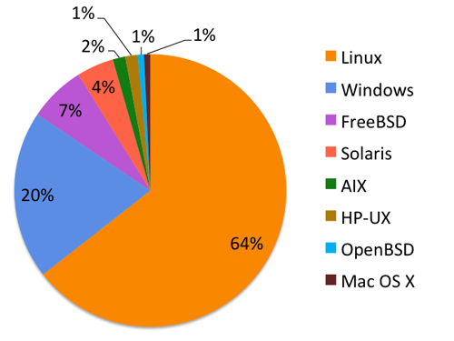
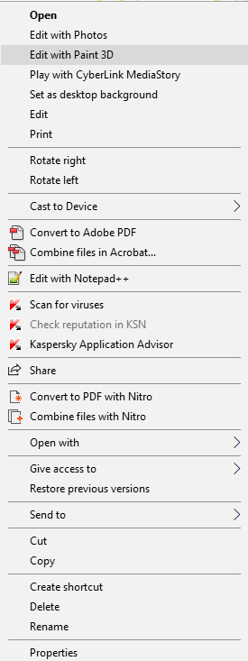
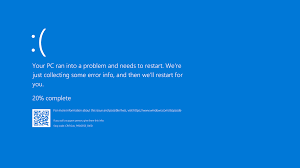

# Welcome to my Github account

+ This file is created by .md which is a language quickly display HTML in github. [Where I learned](https://docs.github.com/en/get-started/writing-on-github/getting-started-with-writing-and-formatting-on-github/basic-writing-and-formatting-syntax) and [where i searched](https://learn.microsoft.com/en-us/azure/devops/project/wiki/markdown-guidance?view=azure-devops)

- Below is all customization of the desktop I'm using to code now.
___
## OS (Operating System)
1. Ubuntu
-   [What is Ubuntu?](https://www.google.com/search?channel=fs&client=ubuntu&q=what+is+ubuntu)

___
-  Why is Ubuntu?
> 1. It's distributed from Linux kernel.
> 2. It's free
> 3. It's commonly used for programing (server, office user)
- Below is operating systems which Apache (a open-source and popular server management software) using 

> 4. It has a fabulous package management / [apt](https://www.google.com/search?channel=fs&client=ubuntu&q=what+is+apt)
-> Ubuntu is perfect to learning and running server
____
2. Window 10
- Not explain what it is, just explain why it not.
> 1. So heavy and much excessive function  
- keyword : [context menu window excessive](https://www.google.com/search?q=context+menu+window+excessive&oq=context+menu+window+excessive&aqs=chrome..69i57j33i160l2.778j0j7&sourceid=chrome&ie=UTF-8)

> 2. Hard to fix system error  

- Why it not notify error to user like other OS?

  

#### Although I decried Windows a lot, the fact that Window is do some work better than Linux

> - Popular and friendly for beginner
> - Security
> - Microsoft become supporting for "devs" and open-source environment
______
### Conclustion
#### I think "Window is good for working and longtime coding, and Linux is accordant for learning and running something 'not GUI'. "
## Software
1. Chrome & Firefox 
>   - I surf the Net, I need good UX, security and multi-task experience better  --> Chrome
>   - I code some web. I need DevTools support better, an open-source software for subribe hosting  --> Firefox
2. Visual Code
- It's free, multi-language support and inteligence AI in suggeting code
> My setup VS code  
> **Extension**
> - For language : 
>     - C/C++ pack (VScode suggest)
>     - Java (VScode suggest + [Generator](https://marketplace.visualstudio.com/items?itemName=sohibe.java-generate-setters-getters))
>     - [Auto-rename tags](https://marketplace.visualstudio.com/items?itemName=formulahendry.auto-rename-tag)
>     - [Live-server](https://marketplace.visualstudio.com/items?itemName=ritwickdey.LiveServer)
> - For ultility : 
>       - [vscode-pdf](https://marketplace.visualstudio.com/items?itemName=tomoki1207.pdf)  
>       - [MySQL](https://marketplace.visualstudio.com/items?itemName=cweijan.vscode-mysql-client2) 
>       - [Better Comment](https://marketplace.visualstudio.com/items?itemName=aaron-bond.better-comments) 
>       - [Intelligen AI](https://marketplace.visualstudio.com/items?itemName=VisualStudioExptTeam.vscodeintellicode) 
>       - [Snipped](https://marketplace.visualstudio.com/items?itemName=JeffersonLicet.snipped)

3. Postman
- Test API
4. K-touch
- "Typing Master" in Linux
___
## Enviroment
1. C++
- Install g++ via terminal `$ sudo apt install -y g++`
2. Java
- Set up JRE, JDK via `sudo apt-get install open-jdk open-jre`
3. MySQL
- `sudo apt install mysql-server`
4. Python
- It's ifinite located in Unix-system.
- Check via `python3 --version`
5. Node
- Run code Javascript like backend programming
- Download from `sudo apt update && sudo apt install -y node`
___
## Conclusion
> All above lines is my desktop setting and I shared it here.  
> I look forward to getting your recommendation!
#### Contact to [me](https://facebook.com/duyhelloworld) .
<h4 align"center">
  <b>Of all things, I like books best</b>
 <h4>
